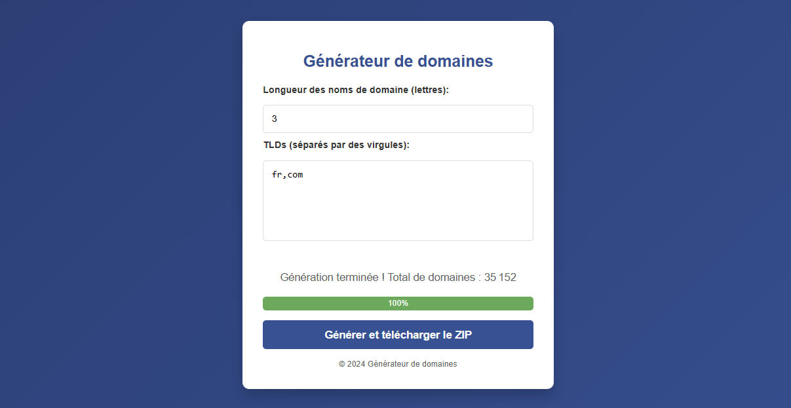

# Rust - Domain Tools

Outils pour la génération et l'analyse de noms de domaine. Interface web pour la génération et application Rust avec vérification et évaluation de domaines.




## Prérequis

1. Rust 1.70+

## Installation

1. Clonez ce dépôt sur votre machine locale.
2. Déplacez-vous dans le répertoire du projet
3. Exécutez la commande `cargo build --release` dans le dossier `domain-checker` pour compiler les outils.

## Utilisation

### Générateur de domaines (Interface Web)

1. Ouvrez le fichier `domain-generator/index.html` dans votre navigateur.
2. Configurez la longueur des domaines et les TLDs souhaités.
3. Générez et téléchargez le fichier ZIP contenant tous les domaines.

### Vérificateur de domaines

Placez votre liste de domaines dans le fichier `domains.csv` du dossier `domain-checker` puis exécutez :

```bash
cd domain-checker

# Vérifier la disponibilité sur tous les TLDs → potential_domains.csv
cargo run --bin check_all

# Vérifier spécifiquement les domaines .fr → available_fr_domains.csv
cargo run --bin check_fr

# Évaluer et classer par score de qualité → best_domains.csv
cargo run --bin best_domains
```

## Fonctionnalités

- Génération massive de domaines avec interface web
- Vérification de disponibilité multi-TLD et spécialisée .fr
- Système de scoring intelligent pour évaluer la qualité
- Export automatique en CSV et ZIP

## Architecture technique

- **domain-checker** : Outils Rust de vérification et évaluation
- **domain-generator** : Interface web de génération

## Algorithme d'évaluation

Le système de scoring évalue les domaines selon plusieurs critères :

- **Mots-clés valorisés** : tech, web, app, dev, etc.
- **Longueur optimale** : Bonus pour les domaines courts
- **Prononçabilité** : Alternance voyelles/consonnes
- **Pénalités** : Consonnes consécutives, caractères non-alphabétiques
- **Lisibilité** : Facilité de mémorisation et de frappe
